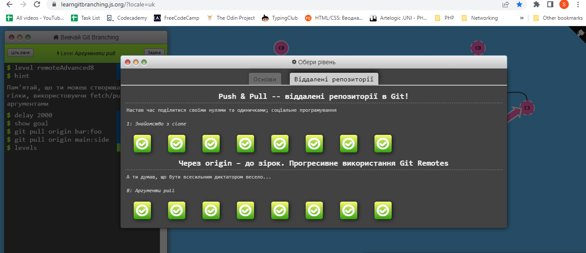

# Front-End Course (_kottans-frontend_)
This repo to track progress on [**Kottans Front-End Course**.](https://github.com/kottans/frontend)

I am interested in :
- Data Engineering 
- Web Development (both _Front and Back-end Development_)

I've created a separate folder with [Educational Notes](notes/readme.md)

# Stage 0. Self-Study

## General

- [x] 0. [Git Basics](#git-and-github) :heavy_check_mark:
- [x] 1. [Linux CLI and Networking](#linux-cli-and-http) :heavy_check_mark:
- [ ] 2. [VCS (hello gitty), GitHub and Collaboration](#git-collaboration) :arrow_forward:
## Front-End Basics
- [ ] 3. Intro to HTML & CSS
- [ ] 4. Responsive Web Design
- [ ] 5. HTML & CSS Practice
- [ ] 6. JavaScript Basics
- [ ] 7. Document Object Model - practice
## Advanced Topics
- [ ] 8. Building a Tiny JS World (pre-OOP) - practice
- [ ] 9. Object oriented JS - practice
- [ ] 10. OOP exercise - practice
- [ ] 11. Offline Web Applications - optional
- [ ] 12. Memory pair game — real project!
- [ ] 13. Website Performance Optimization - optional
- [ ] 14. Friends App - real project!

## Git and GitHub

Review :heavy_check_mark:

### Main :bookmark_tabs:
:white_check_mark: [_Introduction to Git and GitHub_](https://www.coursera.org/learn/introduction-git-github) 
:white_check_mark: [_learngitbranching.js.org_](learngitbranching.js.org) 
:white_check_mark: Create pull request to ___Kottans/mock-repo___  

### Additional :bookmark_tabs:

:green_circle: [_Лекція по Git від Олексія Руденка_](https://www.youtube.com/playlist?list=PLS8sEUxbfFY9MnPIFPTNlaS5xX7P5Ge-5) 
:green_circle: [_Git за 30 хвилин_](https://codeguida.com/post/453) 
:yellow_circle: [_Git tips — закріпити свої знання про Git_](http://sixrevisions.com/web-development/git-tips/) 
:yellow_circle: [_About Merge Conflicts_](https://docs.github.com/en/free-pro-team@latest/github/collaborating-with-issues-and-pull-requests/about-merge-conflicts) 
:yellow_circle: [_Resoilving a Merge Conflict_](https://docs.github.com/en/free-pro-team@latest/github/collaborating-with-issues-and-pull-requests/resolving-a-merge-conflict-using-the-command-line) 
:yellow_circle: [_Communicating using Markdown_](https://lab.github.com/githubtraining/communicating-using-markdown) 
:yellow_circle: [_Learn anything front-end_](https://learn-anything.xyz/web-development/front-end) 
:yellow_circle: [_TypingClub — покращити швидкість набору на клавіатурі_](https://www.typingclub.com/) 
:yellow_circle: [_How to Learn and Cope with Negative Thoughts_](https://guides.hexlet.io/learning/) 

**Short Summary**:

I am pretty new to both **Git** and **GitHub** so everything was new to me. 
It was hard for me and I am not sure if I've managed to understand everything (had troubles finishing my pull request - I did it, but didn't realize 
how this works in fact). While trying Git commands, I become more comfortable with command line itself.
_Coursera_ is an awesome resource, never enrolled there prior this moment and the quality of it is great. 
It is a nice approach that students are explained the core concepts which were before git technology and that helps to understand 
how beneficial Git is. 
As per _learngitbranching_ - Helped to actually see how commits are located and how we can move between them. 
**SourceTree** is a great tool, yet it can be only suplementary for the Terminal.

Task Completed :heavy_check_mark:

## Linux CLI, and HTTP

Review :heavy_check_mark:

### Main :bookmark_tabs: 

:white_check_mark: [Linux Survival (4 modules)](https://linuxsurvival.com/linux-tutorial-introduction/)
 
:white_check_mark: [HTTP: Протокол, який повинен розуміти кожний веб-розробник - Частина 1](https://code.tutsplus.com/uk/tutorials/http-the-protocol-every-web-developer-must-know-part-1--net-31177)
 
:white_check_mark: [HTTP: Протокол, який повинен розуміти кожний веб-розробник - Частина 2](https://code.tutsplus.com/uk/tutorials/http-the-protocol-every-web-developer-must-know-part-2--net-31155)

### Additional :bookmark_tabs:

:yellow_circle: [How I taught myself to code in eight weeks](http://lifehacker.com/how-i-taught-myself-to-code-in-eight-weeks-511615189)
 
:yellow_circle: [How JavaScript works: Deep dive into WebSockets and HTTP/2 with SSE + how to pick the right path](https://blog.sessionstack.com/how-javascript-works-deep-dive-into-websockets-and-http-2-with-sse-how-to-pick-the-right-path-584e6b8e3bf7)
 
:yellow_circle: [Command Line Power User](https://commandlinepoweruser.com/)
 
:yellow_circle: [Configuring Linux Web Servers](https://www.udacity.com/course/configuring-linux-web-servers--ud299)
 
:yellow_circle: [Networking for Web Developers](https://www.udacity.com/course/networking-for-web-developers--ud256)

**Short Summary**

Have never worked on Linux, and had very little experience with Windiws *cmd*. Though there is a bit more commands than 
we may actually need (like sending to print etc.) but I've got basis understading of command line and feel more or less
comfortable. So I am happy with the *Linux Survival* course. 
As per **HTTP** - it was quite uneasy, I understood too little and it is not clear from the article where actually 
these commands should be used. I've got an idea of how important and tough that is so will refer to other materials online.

Task Completed :heavy_check_mark:

## Git Collaboration

Review :heavy_check_mark:

### Main :bookmark_tabs: 

:white_check_mark: [Introduction to Git and GitHub](https://www.coursera.org/learn/introduction-git-github):
- week 3
- week 4

:white_check_mark: [learngitbranching.js.org](https://learngitbranching.js.org/?locale=uk):
- Основи: Переміщуємо роботу туди-сюди
- Віддалені репозиторії: Через origin – до зірок. Прогресивне використання Git Remotes

### Additional :bookmark_tabs:

:yellow_circle: [An Introduction to Git and GitHub by Brian Yu (CS50 course), video, ~40 min.](https://youtu.be/MJUJ4wbFm_A)
:yellow_circle: [Oh shit, git!](http://ohshitgit.com/)
:yellow_circle: [Flight rules for git](https://github.com/k88hudson/git-flight-rules)
:yellow_circle: [GitHub Skills](https://skills.github.com/)

**Short Summary**:
Again I had a good time on Coursera and where Kenny made everything pretty clear. While in gitbranching I found the topics much harder to understand 
despite vizuals. I guess there should be a lot more practice to deal with **Git** especially with remote repos.

Task Completed :heavy_check_mark:

## 3. Intro to HTML & CSS 
In progress

In progress

Review

### Main :bookmark_tabs:

### Additional :bookmark_tabs:

**Short Summary**:

Task Completed

## Responsive Web Design
In progress
## HTML & CSS Practice
In progress
## JavaScript Basics
In progress
## Document Object Model - practice
In progress
## Building a Tiny JS World (pre-OOP) - practice
In progress
## Object oriented JS - practice
In progress
## OOP exercise - practice
In progress
## Offline Web Applications - optional
In progress
## Memory pair game — real project!
In progress
## Website Performance Optimization - optional
In progress
## Friends App - real project!
In progress